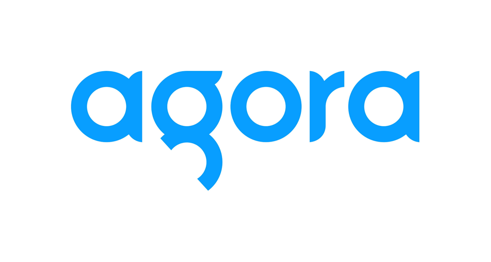

# Welcome To The Agora Challenge

On this page you will find links to Agoras documentation, tutorial videos & articles to help you get started.

[Create an account with Agora here!](https://www.agora.io/en/)

## On this page

- [What is Agora?](#what-is-agora)
- [Tutorials & Code Samples](#tutorials--code-samples)

## ℹ️ What is Agora?

Agora is a real time engagement platform that provides us with all the tools for building like **Audio and Video calling** along with **Real time data signaling** right into your apps.

With agora you get SDKs and low-code tools to build all sorts of video calling features like group chats with screen sharing and recording, streaming to 3rd party platforms like YouTube and so much more.

### Documentation & API Reference 

- [Official Documentation](https://docs.agora.io/en/Video/landing-page?platform=Web)
- [API Reference](https://docs.agora.io/en/Video/API%20Reference/web_ng/index.html)

## 📙 Tutorials & Code Samples

<!-- - [Minimalist Agora Video Call App](#) -->
- [Official Quick Start Guide](https://docs.agora.io/en/Video/start_call_web_ng?platform=Web)

### Tutorials
- [Build A Group Video Chat App In 15 Minutes](https://youtu.be/HX6AM_1-jNM) - Dennis Ivy
- [Coding a video calling app with React](https://youtu.be/ENakkm58Uyw) - Web Dev Junkie
- [Django Video Chat Website With Controls](https://youtu.be/Oxnz8Us1QAQ) - Dennis Ivy

### Code Samples
- [List of demo apps](https://webdemo.agora.io/)