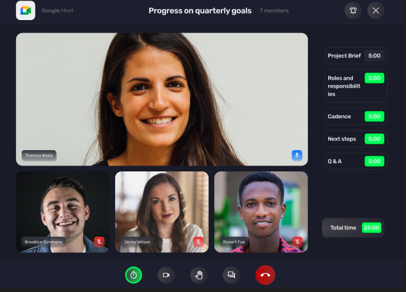

# Finalist for the Agora challenge (11)

**What judges are looking for:**

1. Does the project solve the issue in the problemset?
1. Is the pitch convincing?
1. Creativity
1. Design in prototype

## 1 - QuickMeet (Sahil) 

**Marketing Pitch**

> Quick Meet is fast and simple to use Web App. Password less Login & Sign Up is given, Easy & Quick to use solution and responsive for all devices. Very simple to use interface is given for Scheduling meetings as well. (Only upcoming Scheduled Meetings will be shown in the Dashboard) Fully Authorize & Authenticated System.

**Links:**
- [Github](https://github.com/sahil1sk/dennis_hacthon_project)
- [Live Demo](https://quickmeet.netlify.app/)

 

---

 

## 2 - Conference Time (Paras)

**Marketing Pitch**

> Conference Time is a platform that helps you create time efficient meetings and conferences by providing a lot of features.
Various features are provided so that neither the users lost important info nor the meeting will tend to extend for too long.

**Links:**
- [Github](https://github.com/paras41617/Conference-Time)

 

---

 

## 3 - HyperMeet (Mohamed Salah Hamdon)

**Marketing Pitch**

> Rarely that we join a meet and end at the specified time.
All meeting apps are just video call apps there are no features to improve productivity and stop that wasted time.
HyperMeet is a productivity meeting app came to solve these problmes.

**Links:**
- [GitHub](https://github.com/mohammed5420/hackathon)
- [Figma](https://www.figma.com/proto/rgeH6x7Tg11OF2qfmF6Kwh/Video-Chat---Hackathon-using-Agora?node-id=0%3A177&scaling=min-zoom&page-id=0%3A1&starting-point-node-id=0%3A177)
- [Live Demo](https://hypermeet.vercel.app/)

 

---

 

## 4 - Meetra (Bello Shehu Ango)

**Marketing Pitch**

> Are you tired of those endless meetings? the ones that could be easily addressed in less than an hour? then meetra is for you. Our website helps you increase your productivity during online meetings by segmenting your calls into what we refer to as milestones which are like goals in a meeting, e.g. Discussing Team A's budget allocation

**Links:**
- [Figma](https://www.figma.com/file/ZU0c6dMLvkyQ1tbGZW0ut3/Meetra?node-id=28%3A565)
- [GitHub](https://github.com/Grey-A/Meetra)
- [Video Demo](https://vimeo.com/744000819)

 

---

 

## 5 - RapidMeet (Alexander Garzo)

**Marketing Pitch**

> Did you know that video meeting calls will be a $13.8 billion market by 2023? (ReportBuyer) But it seems being that no one cares about disrupting employee productivity with extra long meetings, and worse still causing a cost of more than $1,250 per employee per month in lost time (Wundamail). So that's why we created RapidMeet, with a call duration exactly as scheduled and a 5-minute extension if and only if everyone in the room agrees.

**Links:**
- [GitHub](https://github.com/garzo94/Video-Meting-Agora-app-Frontend)

 

---

 

## 6 - Hourglass (Daniel Eta)

**Marketing Pitch**

> I built Hourglass, a productivity meeting website that helps users to take charge of their time by setting more rigid meeting periods. If the time elapses, all parties have to mutually consent to having an incremented period. Statistics are also stored so that users can see each others meeting data and perhaps optimize that for evaluation etc. 

**Links**
- [Figma](https://www.figma.com/file/XXSWLdIoh6vi8AvemwIBVb/Hourglass?node-id=0%3A1)
- [Github](https://github.com/danieldoteta/hourglass)

 

---

 

## 7 - (Abdul Rehman Kalsekar)

**Marketing Pitch**

> A Django Video Chat Application

**Links:**
- [Figma](https://www.figma.com/proto/gpVWvubf6emtmyUESGme18/Video-Chat-App?node-id=35%3A422&scaling=min-zoom&page-id=0%3A1&starting-point-node-id=35%3A422)
- [GitHub](https://github.com/arkalsekar/django-video-chat)

 

---

 

## 8 - Meetner (Tobiloba Adedeji)

**Marketing Pitch**

> Meetner is a meeting/collaboration solution to that will improve the virtual experiences of people in meetings.
Most virtual collaboration platforms do not give hosts and audiences distributed controls that Meetener offers like:
1. The timer feature used to segment and order meeting agenda
2. Scheduling just took a whole new dimension when it comes to organizing virtual meetups  with a specific goal in mind by the host and the members alike.
3. The platform gives the opportunity to be time conscious when it comes to deliberating on various topics featured in meetups.

**Links:**
- [Figma](https://www.figma.com/file/mWgr26jiP5y75bInp8pZ3i/Google-meet-clone?node-id=3%3A4)
- [GitHub](https://github.com/tobySolutions/algora-hackathon
)

 

---

 

## 9 - The Meet Point (Ankan Bag)

**Marketing Pitch**

> Meetings are no longer a headache! With our solution you can Work, Collaborate and Call efficiently. Organise and share Notes and create Events flawlessly.

**Links:**
- [Live Demo](https://akbng.github.io/meetpoint)
- [Github](https://github.com/akbng/meetpoint)
- [XD Demo](https://xd.adobe.com/view/fc545581-d6cb-4a8d-92be-775f7346d420-a907/)

 

---

 

## 10 - Sensible  (Ashish Pandagre)

**Marketing Pitch**

> This app will allow users to create instant meetings and have group discussions for a particular agenda, but if someone wants to extend time or say something which might be a concern for only a few people in that meeting, so they can instantly ask them to join a quick another meeting after this. ONly the users who accept the extend request will join that meeting. This way only concerned people will join and other people can just leave after this meeting 

**Links:**
- [GitHub](https://github.com/AshishPandagre/sensible)
- [Figma](https://www.figma.com/file/VrTEojA0ePoi2HuATTaDfk/hackathon?node-id=0%3A1)

 

---

 

## 11 - Zap!t  (Rexathion)

**Marketing Pitch**

> Zapit is a productivity focused online meeting platform with tools to save both Host's and participant's time . Hosts need to set a time limit before starting the meeting , They can also see if everyone is available for a meeting or not using the team calender feature

**Links:**
- [Figma](https://www.figma.com/file/CYRHA8i0Ki52VYkSC26huL/Zapit?node-id=0%3A1)
- [GitHub](https://github.com/rexathion700/zapit-node/)
- [LiveDemo](https://zapit.fly.dev/sign-up)