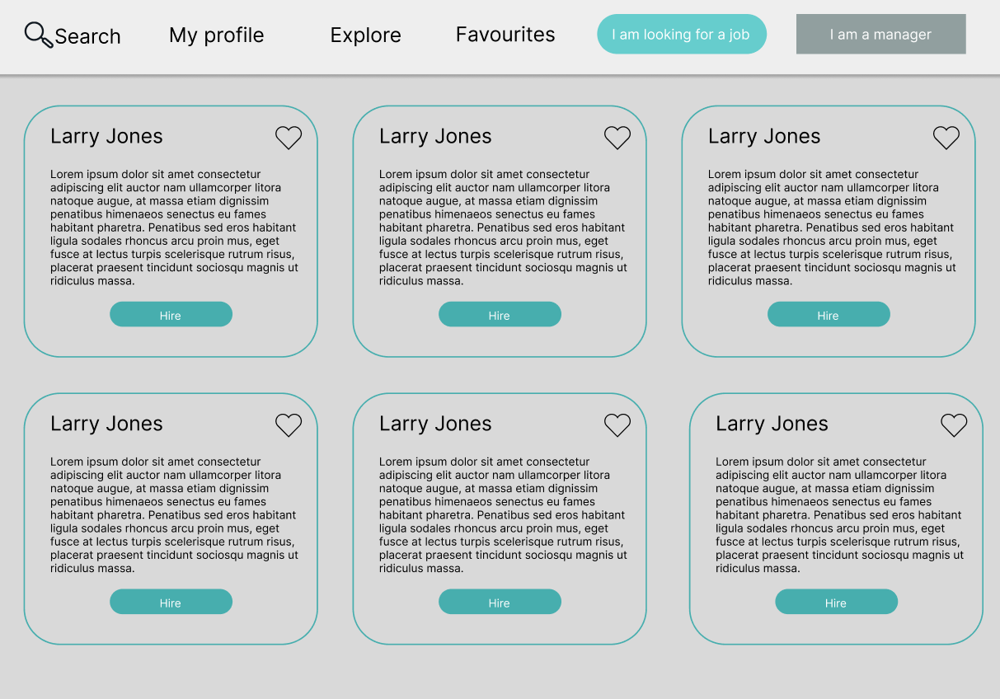

# Finalist for the HarperDB challenge (12)

**What judges are looking for:**

1. Does the project solve the issue in the problemset?
1. Is the pitch convincing?
1. Creativity
1. Design in prototype

## 1 - HirefyApp (Mohamed Muneer)

**Marketing Pitch**

> Hirefy, a no login platform for hiring managers to find suitable candidates for any positions.

**Links:**
- [Github](https://github.com/MohamedMuneerM/hirefy)
- [Live Demo](https://hirefyapp.herokuapp.com/)

**Dennis Notes**
- I like the pinning feature
- Marketing pitch doesn't sell me

 

---

 

## 2 - DevSlide (Abdul Wahab Abass)

**Marketing Pitch**

> This website is a convenient platform for recruiters to easily connect with developers and designers completely for free. No fees or monthly subscriptions needed

**Links:**
- [Github](https://github.com/Nginze/DevSlide)
- [Demo Video](https://www.youtube.com/watch?v=WMnmgLnRy70&feature=youtu.be)

 

---

 

## 3 - HireMe (Pranjal Goyal)

**Marketing Pitch**

> We know how tedious it is to find good developer candidates for a job and make them go through the entire recruitment process. 

> Don't Worry HireMe is here for the rescue, A One-Stop solution to hiring candidates. 

> It covers all the important aspects to hire a candidate, right from creating a job, assigning tasks, and conducting the interview of the candidate. 

**Links:**
- [Github](https://github.com/priyanks25coder/hackathon2022)
- [Figma](https://www.figma.com/proto/omR8NA1EeF4FcY6lPoPovX/Untitled?page-id=0%3A1&node-id=18%3A312&viewport=1432%2C123%2C0.14&scaling=scale-down&starting-point-node-id=18%3A12068)

**Dennis Notes**
- A bit overwhelming but love the effort on the features

 

---

 

## 4 - DevHunt (Oken Keithellakpam)

**Marketing Pitch**

> On Devhunt, you can forgot about having trust issues and running into problems while searching for a developer to handle and solve your developer vacant problems. 

> Connect, view, and hire developers that'll guarantee you fix or solve your issues in no time hassle free. Join now and experience what's so great about it!

**Links**
- [Github](https://github.com/OkenHaha/devhunt)

 

---

 

## 5 - Unlinked (Praveen)

**Marketing Pitch**

> Generally, Looking for cadidates or developers is a very boring process it is no fun at all.

>So what problem unlinked solves is to make hiring process fun and easier on a clutter free interface with the important information that a hiring manager actually need to get the candidate worth for an interview without wasting so much time.

>Firstly it collects all the information from hiring manager.

>Then it provides a clear and clutter free interface to filter out the the candidates by pinning them or swipe to next candidate which can be worth for the interview.

>Pinned Profiles will be saved and you can come later and see list of candidates which you preffered for interview.

**Links:**
- [Video Demo](https://www.youtube.com/watch?v=hIwforbaGcM&feature=youtu.be)
- [Figma](https://www.figma.com/file/cWy6EXvBNzKocgEG3kVL50/Unlinked )
- [Github](https://github.com/PraveenMalethia/unlinked)

**Dennis Notes**
- Love the swiping features

 

---

 

## 6 - Hiringo - (Hussnain Ahmad)

**Marketing Pitch**

> Ever scratched your head while searching for the perfect developers for your role? Look no further, Hiringo brings you the possibility of handpicking perfect developers for your needs. Be it remote, full-time or a contractual based job, you can find all developers here. Worried about budget? We have budget filter too. Once you find your chosen one, simply connect with them, which sends them a notification of your social profiles like LinkedIn, Twitter etc along with the job description to communciate with them easily.

**Links:**
- [Figma](https://www.figma.com/proto/llxaznUjEl1XRVJVydpHYu/Hiringo---Developer-Hiring-using-HarperDB?node-id=0%3A160&scaling=min-zoom&page-id=0%3A1&starting-point-node-id=0%3A423)
- [GitHub](https://github.com/HussnainAhmad1606/Developers-Hub-Hackathon-Project)

 

---

 

## 7 - DevHire (likklepeace & shakyracornelius)

**Marketing Pitch**

> Eliminating hiring managers’ efficiency barriers by providing a bespoke platform connecting them directly to leading, global developer talent. 

> DevHire’s algorithm leverages advanced filtering and the Elo rating system to principally present hiring managers with top-tier professionals. 

> We help hiring managers save time and money and accelerate towards faster growth in high-quality technology  development.

**Links**
- [GitHub](https://github.com/shakyracornelius/hackathon-code-battle-edition)
- [Video](https://clipchamp.com/watch/ptE4j5VBw25)
- [ProtoType](https://github.com/shakyracornelius/hackathon-code-battle-edition/blob/main/DevHire%20Prototype.pdf)

**Dennis Notes**
- I like the swipe left or right feature, although the save functionality is broken.

 

---

 

# 8 HarperJob (Aman Deep)

**Marketing Pitch**

> Most of the HRs find it so annoying to sit on a desk and spend hours of time looking for developers at LinkedIn or Github. And I offer a solution for this time-taking problem with a very easy-to-use service named "Harperjob".By using Harperjob you can get a total information about a developer in very compressed and reliable way.

**Links:**
- [Github](https://github.com/amandeep2603/harperjob)

**Dennis Notes**
- Cool pin and swipe feature

 

---

 

# 9 - DevConnect (Avishek Das)

**MarketingPitch**

> DevConnect, the best place to find skilled developers. Our search makes it easier to find developers based on your job requirements. Developers also can search for jobs and apply, bookmark jobs listed on our site. Developers can directly message to hiring managers. 

**Links:**
- [Github](https://github.com/davishek7/dev-connect)

 

---

 

##  10 - DevHub (Balaji Jethliya)

**Marketing Pitch**

> One of the major challenges faced by Hiring Managers is the lack of an easy process for finding developer/tech talent, DevHub was created to solve that. With DevHub, the need for recruiters to visit multiple websites in search of developers has been eliminated. Talented Developers can now be found in a single search. Hiring Managers can search for a developer's information and save it for subsequent review.

**Links:**
- [Figma](https://www.figma.com/file/DW5JJOJjWzi0EtoPKwz3q7/Dev-Hub)
- [GitHub](https://github.com/jethliya-balaji/DevHub)
- [Live Demo](https://devhub.up.railway.app/login/?next=/)

 

---

 

## 11 - EZRecommend (Saphal Patro)

**Marketing Pitch**

> Modern recruiting practices are broken. Most interview processes rely on a day-long interview. Such an interview practice is not the best way to evaluate a candidate. In my opinion, it is a much better idea to have an entire arsenal of people to back up your skills. Hence, the solution is obviously to rely on recommendations from your coworkers, colleagues as well as managers. However, writing detailed recommendations is time consuming and is usually very specific to a particular job role. I believe providing smaller and more generic recommendations is the right way to go about recruitment. Having a large number of recommendations explaining your expertise is a much better way to go, as a lot of people would vouch for the skills you have as opposed to having only 2-3 people who can speak to your skills. 

**Links**
- [Figma](https://www.figma.com/file/PDOcdN6rKUGYI3HXais0GP/EZRecommend?node-id=0%3A1)
- [GitHub](https://github.com/saphal1998/ez-recommend)
- [Live Demo](https://ez-recommend.vercel.app/)

**Dennis Notes**
- I like the thinking behind this one

 

---

 

## 12 - Erik

**Marketing Pitch**

> All-in-one platform for hiring and finding yourself a job

**Links:**
- [Figma](https://www.figma.com/file/YUR8VHpC9vJgv85fe7Jnz8/Untitled?node-id=0%3A1)
- [Github](https://github.com/erik465/hackaton)